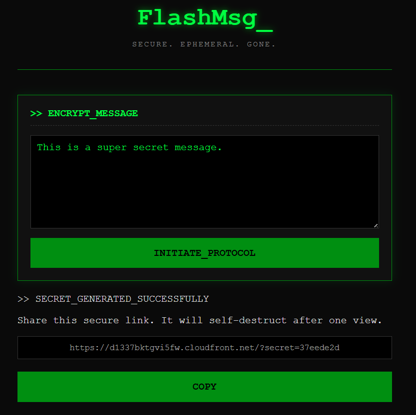
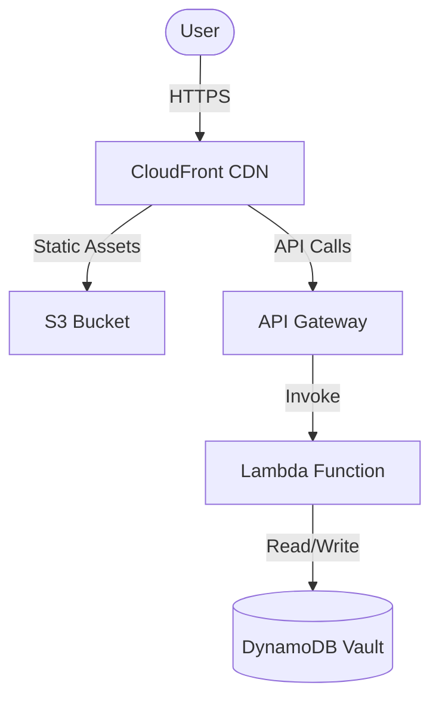

# FlashMsg

**FlashMsg** is a secure, ephemeral messaging application. It allows you to create self-destructing messages that are encrypted and permanently deleted after being read once.

> **"This message will self-destruct in 5 seconds..."**
<br>


*Screenshot: The agent writer interface.*

## The User Experience

### 1. The Writer (Agent Zero)
*   **Input**: You land on a terminal-style interface. You type your top-secret message into the box.
*   **Encrypt**: You click **`INITIATE_PROTOCOL`**. The system encrypts your text and generates a unique, one-time link.
*   **Share**: You copy the link and send it to your contact via any channel (Signal, Email, Slack). **Warning**: Do not click it yourself, or you will destroy it!

### 2. The Reader (The Asset)
*   **Warning**: When they open the link, they see a big **⚠ WARNING ⚠** screen. It informs them that reading the message will trigger its destruction.
*   **Reveal**: They click **`ACKNOWLEDGE & VIEW`**. The message is retrieved, decrypted, and displayed on screen in raw text.
*   **Destruction**: As soon as the data is served, the backend deletes it from the database.
*   **Gone Forever**: If they refresh the page or try to open the link again, they get a **404 - Message Gone** error. The data no longer exists.

## Architecture

FlashMsg is built on a fully **Serverless AWS Architecture**, ensuring high scalability and near-zero cost when idle.



*   **Frontend**: Pure HTML/CSS/JS hosted on **S3** and served globally via **CloudFront** (CDN).
*   **Backend**: **AWS Lambda** (Python) handles encryption and logic.
*   **Database**: **DynamoDB** stores encrypted secrets with a TTL (Time-To-Live).
*   **Infrastructure**: Fully managed as code using **Terraform**.

---

## Deployment & Setup

This project uses a **CI/CD pipeline** (GitHub Actions) to automate infrastructure provisioning and code deployment.

### Prerequisites
1.  **AWS Account**: You need an AWS account.
2.  **Terraform**: Installed locally (for initial setup).
3.  **AWS CLI**: Installed and configured.

### Step 1: Manual Setup (One-Time)
Because we use Terraform with a **Remote Backend** (S3), you must manually create the bucket to store the state file before the first run.

1.  Log in to AWS Console -> S3.
2.  Create a **Private Bucket** (e.g., `flash-msg-tf-state-YOURNAME`).
3.  Update `terraform/main.tf`:
    ```hcl
    terraform {
      backend "s3" {
        bucket = "flash-msg-tf-state-YOURNAME" # <--- Update this
        key    = "terraform.tfstate"
        region = "us-east-1"
      }
    }
    ```

### Step 2: GitHub Secrets
Go to your GitHub Repository -> **Settings** -> **Secrets and variables** -> **Actions** and add:

| Secret Name | Description |
| :--- | :--- |
| `AWS_ACCESS_KEY_ID` | IAM User Key with Admin/Deployer permissions |
| `AWS_SECRET_ACCESS_KEY` | IAM User Secret |
| `AWS_REGION` | e.g., `us-east-1` |

> **Note**: The IAM User must have the permissions defined in [`terraform/deployer_policy.json`](./terraform/deployer_policy.json) attached to their policy to ensure successful deployment and destruction.

### Step 3: Deploy
Just push to the `main` branch!

```bash
git push origin main
```

The **GitHub Action** will automatically:
1.  Initialize Terraform.
2.  Apply infrastructure changes (Lambda, API Gateway, etc.).
3.  Inject the new API URL into the Frontend code.
4.  Sync Frontend files to S3 and invalidate the CloudFront cache.

### Step 4: Infrastructure Teardown
To destroy all AWS resources (Infrastructure as Code) avoiding costs:
1.  Go to **Actions** tab in GitHub.
2.  Select **Destroy FlashMsg** workflow.
3.  Click **Run workflow**.

> This will run `terraform destroy` using your existing secrets.

---

## Local Development

1.  **Backend**:
    The backend is a simple Python script (`backend/app.py`). You can test the logic locally, but it depends on DynamoDB.
    ```bash
    # Install dependencies (optional, for local testing)
    pip install boto3
    ```

2.  **Frontend**:
    The frontend (`frontend/index.html`) is static. You can open it in your browser, but it requires the `API_URL` to work.
    *   *Tip*: After deployment, you can copy the deployed API Gateway URL and hardcode it in `index.html` locally for testing.

---

## Security Features
*   **Ephemeral Storage**: Secrets are deleted from DynamoDB immediately after being retrieved (`delete_item`).
*   **TTL Backup**: Even if a message isn't read, DynamoDB TTL ensures it is purged automatically after 24 hours.
*   **Least Privilege**: The Lambda function only has permission to access its specific DynamoDB table.
